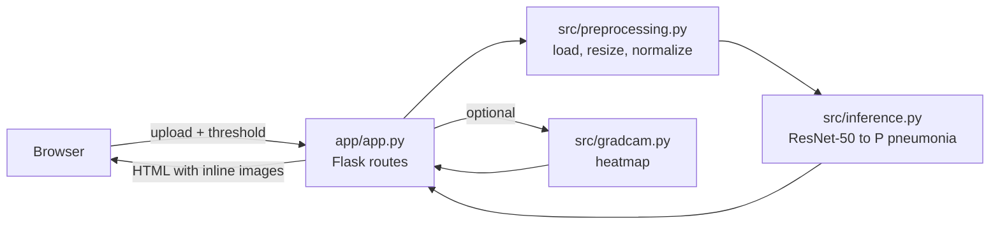

# PneumoDetect: AI-Assisted Pneumonia Detection from Chest X-rays

A small, end-to-end ML project: a **ResNet-50** classifier that flags pneumonia risk on chest X-rays (PNG / JPG / DICOM), a **Grad-CAM** heatmap that shows *where* the model looked, and a **Flask** web app to try it. Trained on the RSNA Pneumonia Detection dataset.

> Research / decision-support prototype. **Not a medical device.**

## What it does

1. Upload a chest X-ray and pick a decision threshold.
2. The app preprocesses it, runs ResNet-50, and returns `P(pneumonia)` and a **High Risk / Low Risk** label.
3. Optionally shows a Grad-CAM overlay of the regions that pushed the model towards "pneumonia".

## Highlights

- **Honest evaluation**: patient-level stratified train/validation split; the best checkpoint is chosen on **validation AUC**, and sensitivity / specificity are logged every epoch.
- **Handles class imbalance**: weighted sampler (`--balanced`) and Focal Loss (`--focal`).
- **Transfer learning**: frozen-backbone baseline or partial fine-tuning of `layer3`/`layer4` (`--finetune`).
- **No train/serve skew**: training and the web app share one preprocessing module.
- **Privacy-minded serving**: uploads are processed in memory and never written to disk.
- **Production basics**: input validation with clear errors, upload size limit, `/health` endpoint, gunicorn in Docker, CI with lint + tests (85% coverage gate).

## Architecture



```text
src/
  preprocessing.py  load PNG/JPG/DICOM, transforms (shared by train + serve)
  data_loader.py    dataset, patient-level split, balanced sampler
  model.py          ResNet-50 baseline (frozen) / fine-tuned (layer3+4)
  losses.py         Focal Loss
  train.py          training loop, validation, checkpointing
  evaluate.py       AUC, sensitivity, specificity
  inference.py      load_model, predict_proba, class mapping, threshold rule
  gradcam.py        Grad-CAM (hooks removed after use)
app/                Flask app + templates
tests/              pytest suite
notebooks/          exploration and analysis
```

## Run it

```bash
python3.11 -m venv .venv
source .venv/bin/activate          # Windows: .venv\Scripts\activate
pip install -r requirements.txt

python app/app.py                  # http://localhost:5001
```

Settings (environment variables): `MODEL_PATH` (default `saved_models/resnet50_best.pt`), `PORT` (default `5001`), `FLASK_DEBUG`, `HOST` (default `127.0.0.1`).

Routes: `GET /` (form), `POST /predict`, `GET /health` -> `{"status": "OK", "model_loaded": true}`.

### Docker

```bash
docker build -t pneumodetect .
docker run --rm -p 5000:5000 pneumodetect      # http://localhost:5000
```

## Train and evaluate

Place the RSNA subset at `data/rsna_subset/` (`stage_2_train_labels.csv` + `train_images/`), then:

```bash
python -m src.train --epochs 5 --batch_size 8 --lr 1e-3           # baseline
python -m src.train --finetune --balanced --lr 1e-4                # fine-tune + balanced
python -m src.train --focal --balanced                             # Focal Loss
python -m src.train --out_dir my_models                            # don't overwrite saved_models/

python -m src.evaluate --csv data/rsna_subset/stage_2_train_labels.csv \
    --img_dir data/rsna_subset/train_images --model saved_models/resnet50_best.pt
```

Each epoch prints train loss/accuracy and validation loss, AUC, sensitivity and specificity; logs go to `reports/week2_metrics/`.

## Test

```bash
flake8 src app tests --max-line-length=100
pytest          # coverage gate is set in pytest.ini
```

Tests run inside a temporary directory, so they never touch your real `saved_models/`.

## Limitations

- **Verify model quality yourself.** Run `python -m src.evaluate` on held-out data and report those numbers. The class order is defined once (`PNEUMONIA_INDEX` in `src/inference.py`, matching the training labels); if AUC comes out well below 0.5 on your data, that index is flipped for your checkpoint.
- Small dataset subset, single source (RSNA); no external validation.
- Grad-CAM is a visual aid, not proof of correct reasoning.
- Not validated for clinical use.

## Credits

Built on the open-source project [AI-Assisted-Pneumonia-Detection-Project](https://github.com/AAdewunmi/AI-Assisted-Pneumonia-Detection-Project) by Adrian Adewunmi (MIT). This version adds a validated training pipeline, shared preprocessing, a hardened in-memory web app, bug fixes, more tests and updated CI.

## License

MIT, see [LICENSE](LICENSE).
